# SQL优化工具

**中文** | [English](readme_en.md)

## 📖 项目简介

SQL 优化工具是一个基于 Spring Boot 3 的 Web 应用，针对给定的查询 SQL 进行智能优化分析，给出合适的索引建议，并支持连接真实数据源做深度优化与执行计划分析。

**核心特性：索引建议颜色区分** —— 已建立的索引以**灰色**（删除线）展示，尚未建立的以**橙色**展示，均支持一键复制。

### ✨ 主要特性

- 🎯 **智能索引建议**：基于 JSqlParser 解析 AST，从 WHERE 等值/范围条件、JOIN ON、ORDER BY、GROUP BY 中提取候选列，生成合理的（组合）索引
- 🎨 **颜色区分状态**：已存在=灰色、缺失/未核实=橙色，一目了然，支持复制粘贴
- ✏️ **手工优化**：粘贴单条 SQL 即时分析
- 🔍 **扫描优化**：扫描项目目录，提取 MyBatis XML、Java 代码中的 SQL 字符串、注解中的 SQL（`@Select`/`@Insert`/`@Update`/`@Delete`/`@Query`），逐条分析并支持一键原地替换（自动 `.bak` 备份）
- 🤖 **AI 深度优化**（可选）：支持配置多个 AI 模型（百炼 / DeepSeek / OpenAI / Anthropic 及各类 OpenAI 兼容网关），同一时刻启用一个，对 SQL 智能改写
- 🔗 **配置数据源**（可选）：配置后可进行——
  - 索引存在性检测（区分灰/橙）
  - 冗余索引检测（给出 DROP 建议）
  - 大小表驱动判断（小表驱动大表建议）
- 📊 **SQL 执行计划**：连接数据源后执行 EXPLAIN，提供**表格 / 树形 / 图形**三种视图（类 DBeaver）：
  - 表格：结构化列 Operation / Object / Rows / Cost / Node Type
  - 树形 / 图形：按执行计划层级展示节点，按操作类型着色（全表扫描红、索引绿、JOIN 紫等）
  - 成本过高才建议加索引，数据量很少则提示无需建立

### 🎨 设计逻辑

| 场景 | 行为 |
|------|------|
| **未配置数据源** | 索引建议全部**橙色**（无法核实是否已存在），可复制 `CREATE INDEX`；执行计划页提示"请先配置数据源" |
| **已配置数据源** | 索引区分**灰色（已存在）/ 橙色（缺失）**；额外给出冗余索引、大小表驱动建议；可用执行计划分析 |
| **手工/扫描页头** | 配置数据源后顶部显示"✅ 已配置数据源，可进行深度优化" |

## 🖼️ 功能截图

### ✏️ 手工优化

粘贴单条 SQL 即时分析：未开启 AI 时给出索引建议与优化提示（不改动 SQL）；开启 AI 后智能改写，AI 超时/失败会自动降级为本地规则改写。

**本地规则分析（未开 AI）：** 索引建议区分「建议创建 / 已存在」，连接数据源后为深度检测

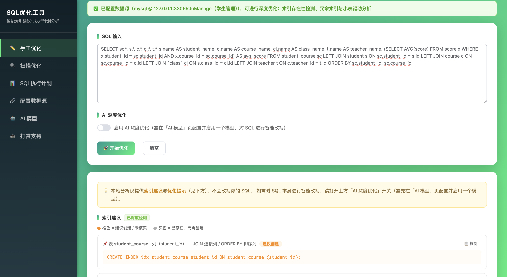

**开启 AI 深度优化：**

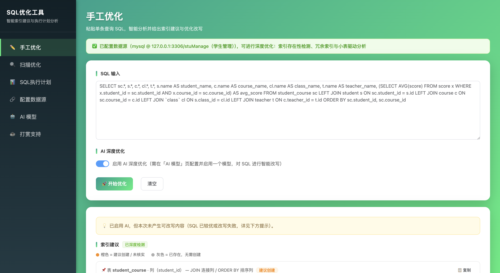

**深度分析详情：** 各表实际行数、小表驱动大表建议、冗余/已有索引判定；AI 超时时明确提示原因（本例为响应超时 60s，引导检查火山方舟 Base URL 与接入点 ID）

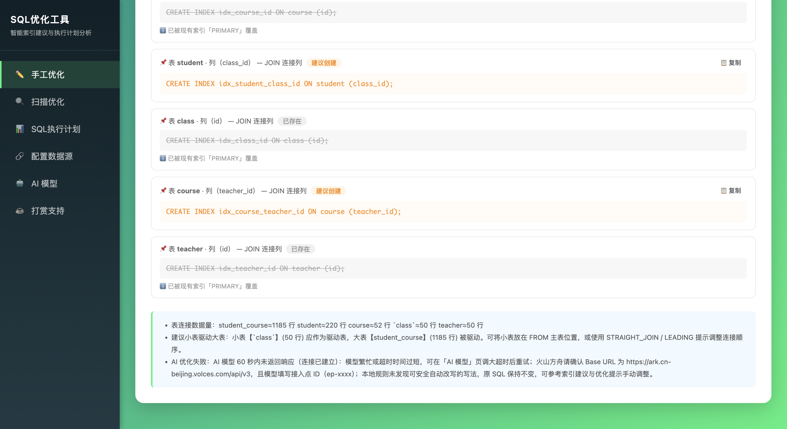

### 🔍 扫描优化

选择项目目录后扫描 MyBatis XML、Java 代码、`.sql` 脚本中的 SQL，逐条给出优化建议并可一键原地替换（自动 `.bak` 备份）。扫描是服务端后台任务，可以放心切到其他页面，回来自动展示结果。

**后台扫描进行中（8 路并发 AI 改写，可随时取消/切页）：**

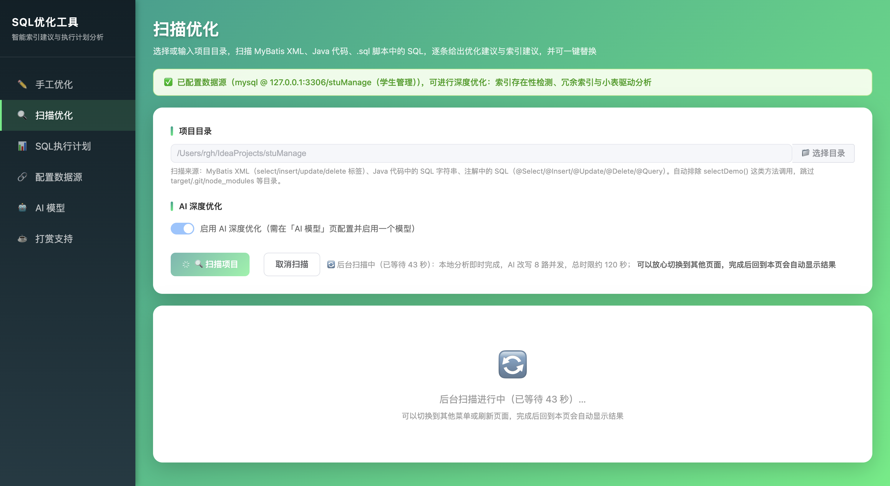

**逐条结果：源 SQL / 优化后 SQL（AI 或规则标签）/ 索引建议：**

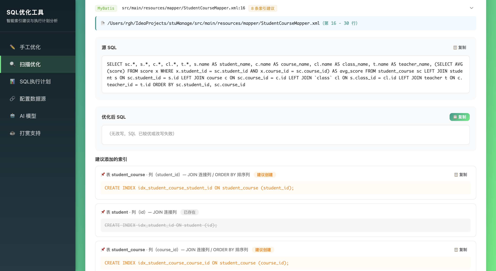

### 🔗 配置数据源

可保存多个数据库连接，通过开关互斥启用（启用新的自动停用旧的），密码加密存储、配置持久化重启不丢；内置达梦 / openGauss / 人大金仓等信创驱动，并支持自定义 JDBC URL。

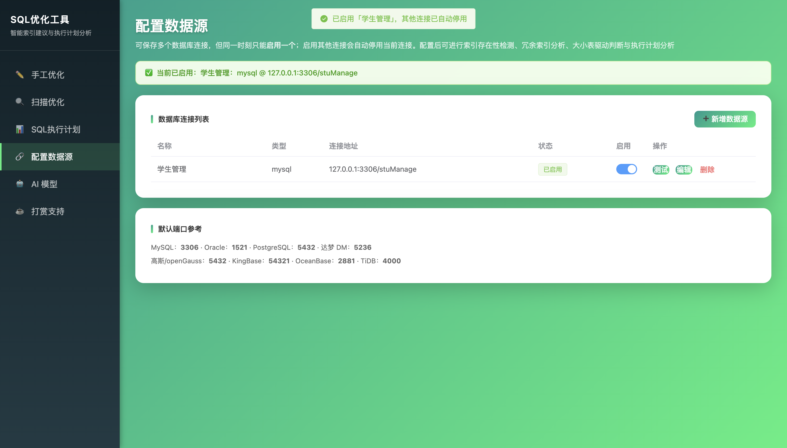

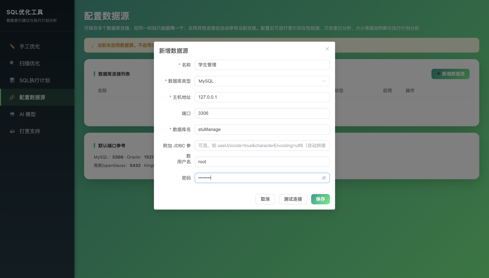

### 🤖 AI 模型

可保存多个 AI 模型配置（OpenAI 兼容 / Anthropic 协议、Base URL、模型、API Key），同一时刻只能启用一个；支持「测试连通性」与最近探测状态展示，编辑时 Key 留空表示不修改。

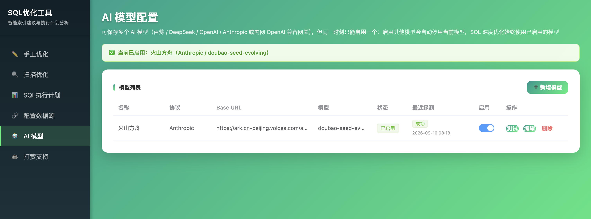

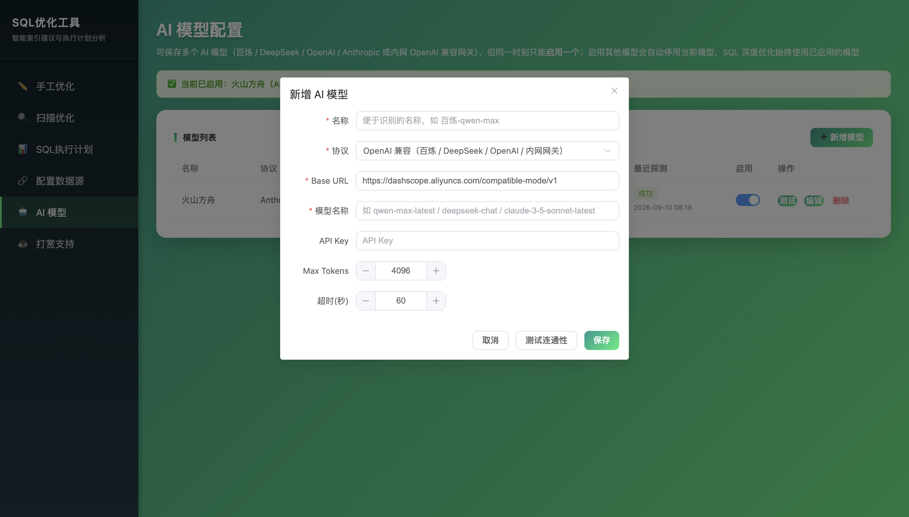

### 📊 SQL 执行计划

连接数据源后执行 EXPLAIN，提供表格 / 树形 / 图形三种视图（类 DBeaver），按操作类型着色（全表扫描红、索引查找绿、JOIN 紫），并给出成本评估。

**表格视图：**

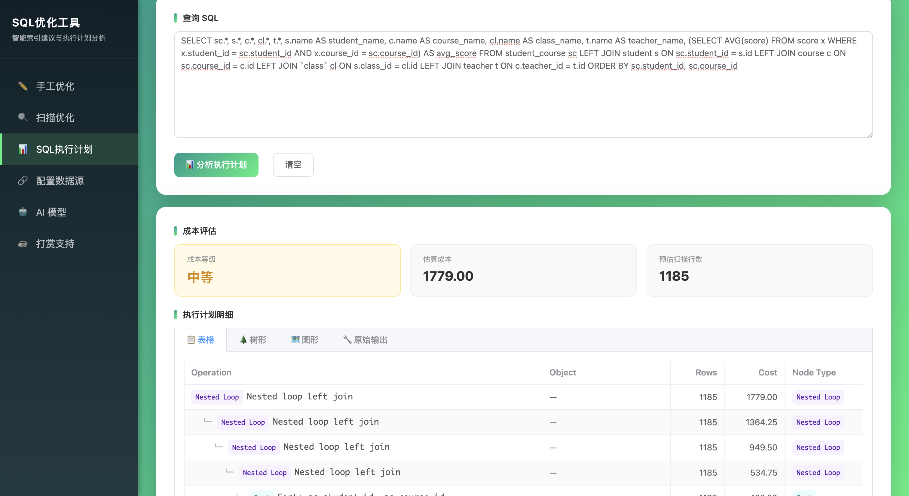

**树形视图：**

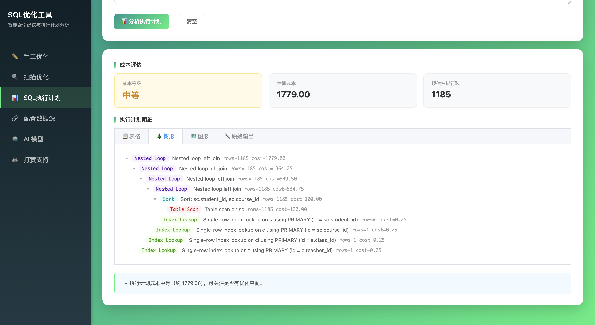

## 🛠️ 技术栈

| 组件 | 技术 |
|------|------|
| 后端 | Spring Boot 3.2, JSqlParser 4.9, HikariCP, JDK HttpClient |
| 前端 | Vue 3 CDN + Element Plus CDN（纯 HTML，无构建工具） |
| 配置存储 | H2 文件库（`./data`）+ Spring Data JPA；密码/API Key 使用 spring-security-crypto 加密落库 |
| AI 接口 | OpenAI 兼容协议（百炼 / DeepSeek / OpenAI / 内网网关）+ Anthropic Messages 协议 |
| 数据库驱动 | MySQL、PostgreSQL、Oracle、达梦 DM8、openGauss、人大金仓 KingBaseES（信创原厂驱动均已内置） |
| 构建 | Maven, JDK 17+ |

## 🚀 快速开始

```bash
cd sql-optimizer-tool

# 编译打包
mvn clean package

# 运行（默认端口 8090）
java -jar target/sql-optimizer-tool-1.0.0.jar
```

访问：http://localhost:8090

打包产物为单个可执行 fat jar（约 64MB，内置 MySQL / PostgreSQL / Oracle / 达梦 / openGauss / 人大金仓驱动与前端页面），拷到装有 **JDK 17+** 的内网机器即可直接运行，无需 Maven、无需联网：

```bash
java -jar sql-optimizer-tool-1.0.0.jar
# 可选：覆盖端口 / 监听地址 / 配置库加密口令
java -jar sql-optimizer-tool-1.0.0.jar --server.port=8090 --server.address=0.0.0.0
```

部署说明：

- 数据库与 AI 配置保存在运行目录下的 `./data`（H2 文件库），日志在 `./logs/`，部署时注意这两个目录的持久化与备份；**不要删除 `./data`，否则所有配置丢失**。固定从同一工作目录启动；也可用环境变量 `APP_DATA_DIR` 把配置库指到绝对路径（如 `APP_DATA_DIR=/var/sql-optimizer/data`），启动日志会打印配置库的实际位置；
- 默认只监听 `127.0.0.1`，局域网访问需加 `--server.address=0.0.0.0` 并自行在网关加鉴权；
- 达梦 / openGauss / 人大金仓驱动已内置；其他未内置驱动的数据库使用「自定义」类型，把驱动 jar 放到运行机器上指定路径即可；
- AI 调用从运行机器直接访问所配置的 Base URL，请确保内网到该地址的网络可达。

### 配置 AI（可选）

在左侧「AI 模型」页新增配置：选择协议（OpenAI 兼容 / Anthropic），填写 Base URL、模型名与 API Key，可先「测试连通性」再保存，最后打开启用开关。多个模型只能启用一个，切换启用会自动停用其他模型。Base URL 自由填写，任何 OpenAI 兼容的内网网关/自建推理服务均可接入。

不启用任何模型也可正常使用索引分析（仅 AI 深度改写不可用）。

## 📊 支持的数据库（数据源连接）

| 数据库 | 类型标识 | 驱动 | 默认端口 |
|--------|---------|------|---------|
| MySQL | `mysql` | MySQL 驱动 | 3306 |
| Oracle | `oracle` | Oracle 驱动 | 1521 |
| PostgreSQL | `postgresql` | PostgreSQL 驱动 | 5432 |
| 达梦 DM8 | `dameng` | **DmJdbcDriver18（内置）** | 5236 |
| GaussDB | `gaussdb` | PostgreSQL 驱动（走 PG 协议） | 5432 |
| openGauss | `opengauss` | **opengauss-jdbc（内置）** | 5432 |
| 人大金仓 KingBaseES V8 | `kingbase` | **kingbase8（内置）** | 54321 |
| OceanBase | `oceanbase` | MySQL 驱动 | 2881 |
| TiDB | `tidb` | MySQL 驱动 | 4000 |
| 自定义 | `custom` | 填写完整 JDBC URL + 驱动类名；驱动不在内置列表时可指定服务器本地 jar 路径（文件或目录，多个用 `;` 分隔），支持「扫描 jar」自动读取驱动类名；支持免密库与附加 URL 参数 | — |

### 信创数据库驱动说明

达梦 DM8（`com.dameng:DmJdbcDriver18:8.1.3.140`）、openGauss（`org.opengauss:opengauss-jdbc:5.0.3-og`）、
人大金仓 KingBaseES V8（`cn.com.kingbase:kingbase8:9.0.1`）的原厂驱动均已打进 fat jar，开箱即用：

- **达梦**：驱动类 `dm.jdbc.driver.DmDriver`，URL `jdbc:dm://host:5236`，「数据库名」填模式（Schema）名
- **openGauss**：驱动类 `org.opengauss.Driver`，URL `jdbc:opengauss://host:5432/库名`
- **人大金仓**：驱动类 `com.kingbase8.Driver`，URL `jdbc:kingbase8://host:54321/库名`
- **GaussDB**：走 PostgreSQL 协议，使用内置 PostgreSQL 驱动 `jdbc:postgresql://host:5432/库名`

如果你的数据库版本较旧/较新、与内置驱动不兼容，无需重新打包——页面上选择「自定义」类型，
指定服务器上对应版本驱动 jar 的路径（配合「扫描 jar」自动填充驱动类名）与完整 JDBC URL 即可。

## 📡 API 接口

| 接口 | 方法 | 说明 |
|------|------|------|
| `/api/optimize/start` | POST | 提交异步优化任务，返回 jobId（页面使用） |
| `/api/optimize/jobs/{jobId}` | GET | 查询优化任务状态（RUNNING/SUCCESS/FAILED/CANCELLED，成功时携带结果） |
| `/api/optimize/jobs/{jobId}/cancel` | POST | 取消优化任务 |
| `/api/optimize` | POST | 优化单条 SQL（同步接口，保留兼容） |
| `/api/optimize/batch` | POST | 批量优化多条 SQL（分号分隔） |
| `/api/status` | GET | 全局状态（是否已配数据源 / AI） |
| `/api/explain` | POST | 执行计划分析（需数据源） |
| `/api/scan/start` | POST | 提交异步扫描任务，返回 jobId（页面使用） |
| `/api/scan/jobs/{jobId}` | GET | 查询扫描任务状态（RUNNING/SUCCESS/FAILED/CANCELLED，成功时携带结果） |
| `/api/scan/jobs/{jobId}/cancel` | POST | 取消扫描任务 |
| `/api/scan` | POST | 同步扫描项目目录并提取 SQL（保留兼容） |
| `/api/scan/replace` | POST | 将优化后的 SQL 替换回源文件（自动 `.bak` 备份） |
| `/api/scan/dirs` | GET | 浏览服务器目录树（供目录选择器使用） |
| `/api/datasource/list` | GET | 全部数据库连接（密码不回传） |
| `/api/datasource/save` | POST | 新建/更新连接（编辑时密码留空表示不修改） |
| `/api/datasource/{id}/enable` | POST | 启用连接（互斥：自动停用其他连接，先验证后热切换） |
| `/api/datasource/{id}/disable` | POST | 停用连接 |
| `/api/datasource/{id}/test`、`/api/datasource/test` | POST | 测试已保存/未保存的连接 |
| `/api/datasource/discover-drivers?jarPath=` | GET | 扫描外部驱动 jar 中声明的驱动类名（自定义类型） |
| `/api/datasource/{id}/delete` | POST | 删除连接（已启用需先停用） |
| `/api/datasource/status` | GET | 当前活动连接状态 |
| `/api/ai/list`、`/api/ai/save` | GET/POST | AI 模型列表 / 新建·更新（Key 不回传，留空不修改） |
| `/api/ai/{id}/enable`、`/disable`、`/delete`、`/test` | POST | AI 模型互斥启用 / 停用 / 删除 / 探测 |
| `/api/ai/protocol-defaults` | GET | 协议默认 Base URL |

## 📁 项目结构

```
sql-optimizer-tool/
├── docs/                                     # 功能截图
├── src/main/java/com/sqloptimizer/
│   ├── SqlOptimizerApplication.java         # 启动类（H2 平台库存放多数据源/AI 配置）
│   ├── common/                              # Result / IndexSuggestion / OptimizeResult
│   │                                        # ExplainResult / ExplainRow / PlanNode / ScanItem
│   ├── entity/                              # DatabaseConfig / AiProvider / AiProtocol（JPA 实体）
│   ├── repository/                          # DatabaseConfigRepository / AiProviderRepository
│   ├── util/CryptoUtil.java                 # 密码 / API Key 落库加密
│   ├── config/                              # 全局异常处理
│   ├── controller/
│   │   ├── OptimizeController.java          # 优化 + 批量 + 状态
│   │   ├── ExplainController.java           # 执行计划
│   │   ├── ScanController.java              # 项目扫描 + 替换 + 目录浏览
│   │   ├── DataSourceController.java        # 数据源多配置 CRUD / 互斥启用
│   │   └── AiProviderController.java        # AI 模型多配置 CRUD / 互斥启用
│   └── service/
│       ├── IndexAnalyzerService.java        # 索引候选列提取（规则引擎核心）
│       ├── SqlOptimizerService.java         # 优化编排：组合规则/数据源/AI
│       ├── OptimizeJobManager.java          # 单条优化的后台任务（提交/轮询/取消）
│       ├── ProjectScanService.java          # 项目扫描与原地替换
│       ├── LocalRewriteService.java         # AI 不可用时的保底规则改写（JOIN/HAVING/SELECT *）
│       ├── ScanJobManager.java              # 扫描后台任务（提交/轮询/取消）
│       ├── DatabaseConfigService.java       # 数据源配置 CRUD + 唯一启用标志（事务）
│       ├── DataSourceService.java           # 活动池热切换/索引检测/大小表/冗余索引
│       ├── AiProviderService.java           # AI 模型 CRUD + 唯一启用 + 探测记录
│       ├── AiChatClient.java                # OpenAI 兼容 / Anthropic 两种协议的 HTTP 客户端
│       ├── AiConnectionTestService.java     # AI 端点探测（max_tokens=1）
│       ├── ExplainService.java              # EXPLAIN 执行、计划树解析与成本评估
│       └── AiService.java                   # 基于启用模型的 SQL 深度优化
└── src/main/resources/
    ├── application.yml
    └── static/
        ├── index.html         # 入口（跳转手工优化）
        ├── common.css         # 共享样式
        ├── manual.html        # 手工优化
        ├── auto.html          # 扫描优化
        ├── explain.html       # SQL 执行计划
        ├── datasource.html    # 数据源多配置管理（互斥启用）
        ├── ai.html            # AI 模型多配置管理（互斥启用）
        ├── donate.html        # 打赏支持
        └── image/
            └── ds.png         # 打赏二维码
```

## 📝 注意事项

1. **多配置与互斥启用**：数据库连接与 AI 模型均可保存多个，各自同一时刻只能启用一个，互斥关系由服务端事务保证；配置保存在 `./data` 的 H2 文件库中，重启不丢。密码/API Key 加密存储、不回传前端，编辑时留空表示沿用原值；加密口令可用环境变量 `APP_CRYPTO_PASSWORD` / `APP_CRYPTO_SALT` 覆盖。启动时会自动尝试恢复上次启用的数据库连接，失败则在页面显示“启用中·连接失败”。
   - **优化/扫描都是服务端后台任务**：手工优化与项目扫描点击后都立即返回任务 ID，任务在服务端线程执行、与浏览器连接无关——执行中切换菜单、整页跳转甚至刷新页面，回来后凭暂存在 sessionStorage 的任务 ID 自动恢复「进行中」状态并继续轮询，完成后自动展示结果；也可随时取消。任务结果在服务端保留 30 分钟（服务重启后任务丢失，页面会提示重新执行）。
   - **扫描优化的 AI 执行策略**：所有 SQL 先完成毫秒级本地规则分析，AI 改写再**并发**执行（默认并发 8、单次最多 20 条、总时限 120 秒、单请求 45 秒上限）；挂死的单请求 45 秒释放名额给后续 SQL，到总时限未完成的条目自动降级本地规则改写并附超时提示。可用 `APP_AI_SCAN_CONCURRENCY` / `APP_AI_SCAN_TIMEOUT` / `APP_AI_SCAN_PER_REQUEST_TIMEOUT` 调整。
   - **AI 失败/超时自动降级规则改写**：开启 AI 后，无论未配置模型、请求超时、连接失败、HTTP 错误还是返回为空，都不会再「什么也不变化」——自动回退到本地确定性规则改写（仅做保证语义不变的三类改写：①逗号隐式连接转 ANSI `INNER JOIN ... ON`；② HAVING 中的非聚合过滤条件下移到 WHERE；③已连接数据源时单表 `SELECT *` 按元数据展开为具体列），结果会带「规则改写」标签并逐条列出改动；没有可安全改写的写法时保留原文并给出说明。
   - **AI 网络与代理**：连接超时（连不上，常见于公司内网直连外网受限）与响应超时（已连通但模型不返回，常见于模型繁忙、超时过短或 Base URL / 模型名填错，如火山方舟须填接入点 ID `ep-xxxx`、Base URL 为 `https://ark.cn-beijing.volces.com/api/v3`）会给出不同的错误提示。需要代理出网时设置环境变量 `HTTPS_PROXY`（或 `APP_AI_PROXY`，形如 `http://127.0.0.1:7890`）后重启；本机地址始终直连。
2. **执行计划安全**：PostgreSQL 系使用 `EXPLAIN`（不含 ANALYZE），不会真实执行写操作。
3. **执行计划视图**：MySQL 8 通过 `EXPLAIN FORMAT=JSON` 解析出结构化计划树（表格/树形/图形）；其他数据库回退为原始表格。
4. **索引匹配规则**：检测已存在索引时采用"最左前缀匹配"，与数据库索引使用逻辑一致。
5. **成本阈值**：执行计划成本 ≥10000 判为偏高才给索引建议；预估扫描行数 ≤500 判为数据量小，提示无需建索引（阈值可在 `ExplainService` 调整）。

## ☕ 打赏支持

如果这个项目对你有帮助，欢迎请我喝杯咖啡 ❤️


> 也可在应用内左侧菜单「打赏支持」查看。

## ⭐ Star 支持

觉得好用的话，欢迎给项目点个 **[Star](https://github.com/vfaner/sql-optimizer-tool)** 支持一下，这是对作者最大的鼓励！

## 📄 许可证

个人 / 非商业使用免费。
