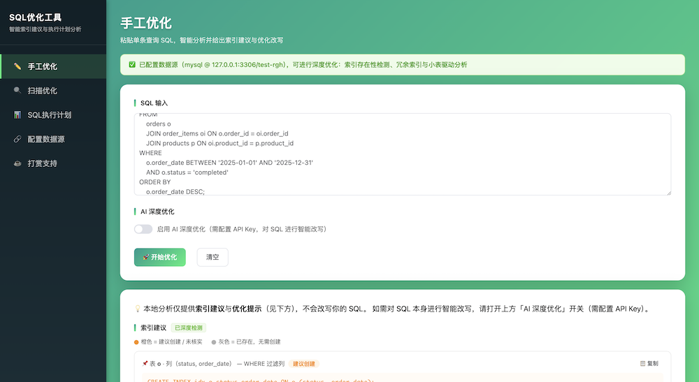
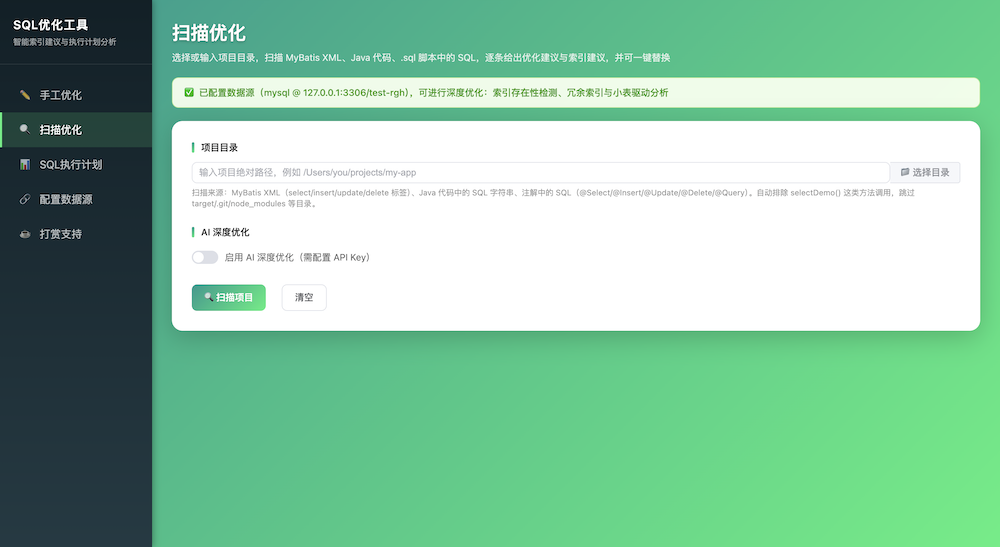
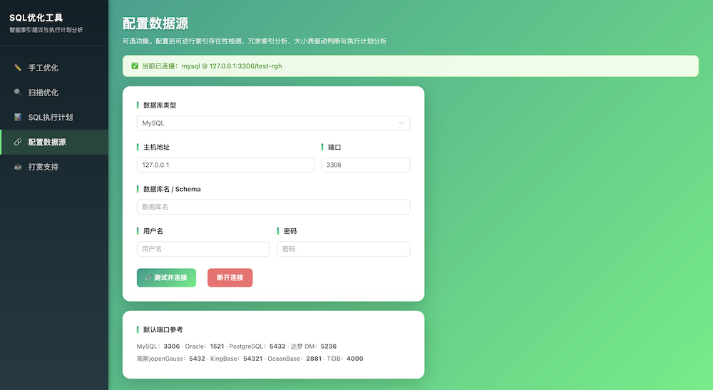
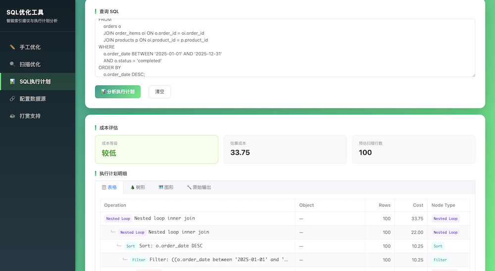

# SQL Optimizer Tool

[中文](README.md) | **English**

## 📖 Introduction

SQL Optimizer Tool is a Spring Boot 3 web application that performs intelligent optimization analysis on a given query SQL, produces appropriate index suggestions, and supports connecting to a real data source for deep optimization and execution-plan analysis.

**Core feature: color-coded index suggestions** — existing indexes are shown in **gray** (strikethrough), while missing ones are shown in **orange**, all with one-click copy.

### ✨ Key Features

- 🎯 **Smart index suggestions**: Parses the AST with JSqlParser and extracts candidate columns from WHERE equality/range conditions, JOIN ON, ORDER BY, and GROUP BY to generate reasonable (composite) indexes
- 🎨 **Color-coded status**: Existing = gray, missing/unverified = orange — clear at a glance, copy-paste ready
- ✏️ **Manual optimization**: Paste a single SQL for instant analysis
- 🔍 **Scan optimization**: Scan a project directory to extract SQL from MyBatis XML, SQL strings in Java code, and SQL in annotations (`@Select`/`@Insert`/`@Update`/`@Delete`/`@Query`); analyze each and replace in place with a one click (auto `.bak` backup)
- 🤖 **AI deep optimization** (optional): Integrates Alibaba Cloud Bailian (Tongyi Qianwen) to intelligently rewrite SQL
- 🔗 **Data source configuration** (optional): Once configured, enables —
  - Index existence detection (gray/orange distinction)
  - Redundant index detection (with DROP suggestions)
  - Small-table-drives-large-table analysis
- 📊 **SQL execution plan**: Runs EXPLAIN after connecting a data source, with **Table / Tree / Diagram** views (DBeaver-style):
  - Table: structured columns Operation / Object / Rows / Cost / Node Type
  - Tree / Diagram: nodes laid out by plan hierarchy, color-coded by operation type (full scan = red, index = green, join = purple, etc.)
  - Only suggests indexes when cost is high, and hints "no index needed" when data volume is small

### 🎨 Design Logic

| Scenario | Behavior |
|----------|----------|
| **No data source configured** | All index suggestions are **orange** (existence cannot be verified); `CREATE INDEX` is copyable; the execution-plan page prompts "please configure a data source first" |
| **Data source configured** | Indexes are distinguished as **gray (existing) / orange (missing)**; additionally provides redundant-index and small/large-table-driving suggestions; execution-plan analysis is available |
| **Manual/Scan page header** | After configuring a data source, the top shows "✅ Data source configured, deep optimization available" |

## 🖼️ Screenshots

### ✏️ Manual Optimization


### 🔍 Scan Optimization


### 🔗 Data Source Configuration


### 📊 SQL Execution Plan


## 🛠️ Tech Stack

| Component | Technology |
|-----------|------------|
| Backend | Spring Boot 3.2, JSqlParser 4.9, HikariCP, OkHttp 4.12 |
| Frontend | Vue 3 CDN + Element Plus CDN (pure HTML, no build tool) |
| AI API | Alibaba Cloud Bailian OpenAI-compatible interface (qwen-max) |
| DB drivers | MySQL Connector/J, PostgreSQL JDBC, Oracle JDBC; DM (Dameng) added manually |
| Build | Maven, JDK 17+ |

## 🚀 Quick Start

```bash
cd sql-optimizer-tool

# Build & package
mvn clean package

# Run (default port 8090)
java -jar target/sql-optimizer-tool-1.0.0.jar
```

Visit: http://localhost:8090

### Configure AI (optional)

```bash
export AI_API_KEY=your_bailian_api_key
```

Index analysis works fine without an API key (only AI-based deep rewriting is unavailable).

## 📊 Supported Databases (data source connection)

| Database | Type ID | Driver | Default Port |
|----------|---------|--------|--------------|
| MySQL | `mysql` | MySQL driver | 3306 |
| Oracle | `oracle` | Oracle driver | 1521 |
| PostgreSQL | `postgresql` | PostgreSQL driver | 5432 |
| Dameng DM | `dameng` | Add manually (see below) | 5236 |
| GaussDB/openGauss | `gaussdb` | PostgreSQL driver | 5432 |
| KingBase | `kingbase` | PostgreSQL driver | 54321 |
| OceanBase | `oceanbase` | MySQL driver | 2881 |
| TiDB | `tidb` | MySQL driver | 4000 |

### Dameng (DM) Driver Notes

The Dameng JDBC driver is not published to Maven Central and must be added manually:

1. Obtain `DmJdbcDriver18.jar` from the Dameng installation directory
2. Install it into the local Maven repository:
   ```bash
   mvn install:install-file -Dfile=DmJdbcDriver18.jar \
     -DgroupId=com.dameng -DartifactId=DmJdbcDriver18 \
     -Dversion=8.1 -Dpackaging=jar
   ```
3. Add the corresponding dependency in `pom.xml` and repackage, or append the jar with `-cp` at startup.

## 📡 API Endpoints

| Endpoint | Method | Description |
|----------|--------|-------------|
| `/api/optimize` | POST | Optimize a single SQL |
| `/api/optimize/batch` | POST | Batch-optimize multiple SQL (semicolon-separated) |
| `/api/status` | GET | Global status (data source / AI configured) |
| `/api/explain` | POST | Execution-plan analysis (requires data source) |
| `/api/scan` | POST | Scan a project directory and extract SQL |
| `/api/scan/replace` | POST | Replace optimized SQL back into the source file (auto `.bak` backup) |
| `/api/scan/dirs` | GET | Browse server directory tree (for the directory picker) |
| `/api/datasource/connect` | POST | Test and connect a data source |
| `/api/datasource/disconnect` | POST | Disconnect the data source |
| `/api/datasource/status` | GET | Current data source status |

## 📁 Project Structure

```
sql-optimizer-tool/
├── docs/                                     # Screenshots
├── src/main/java/com/sqloptimizer/
│   ├── SqlOptimizerApplication.java         # Startup class (excludes default data source auto-config)
│   ├── common/                              # Result / IndexSuggestion / OptimizeResult
│   │                                        # ExplainResult / ExplainRow / PlanNode
│   │                                        # DataSourceConfig / ScanItem
│   ├── config/                              # Global exception handling
│   ├── controller/
│   │   ├── OptimizeController.java          # Optimize + batch + status
│   │   ├── ExplainController.java           # Execution plan
│   │   ├── ScanController.java              # Project scan + replace + directory browsing
│   │   └── DataSourceController.java        # Data source configuration
│   └── service/
│       ├── IndexAnalyzerService.java        # Index candidate extraction (rule engine core)
│       ├── SqlOptimizerService.java         # Optimization orchestration: rules/data source/AI
│       ├── ProjectScanService.java          # Project scanning & in-place replacement
│       ├── DataSourceService.java           # Connection/index detection/table size/redundant indexes
│       ├── ExplainService.java              # EXPLAIN execution, plan-tree parsing & cost evaluation
│       └── AiService.java                   # Bailian AI service
└── src/main/resources/
    ├── application.yml
    └── static/
        ├── index.html         # Entry (redirects to manual optimization)
        ├── common.css         # Shared styles
        ├── manual.html        # Manual optimization
        ├── auto.html          # Scan optimization
        ├── explain.html       # SQL execution plan
        ├── datasource.html    # Data source configuration
        ├── donate.html        # Donation support
        └── image/
            └── ds.png         # Donation QR code
```

## 📝 Notes

1. **In-memory data source**: The configured connection is kept in memory only and must be reconfigured after a restart; passwords are never returned to the frontend.
2. **Execution-plan safety**: For PostgreSQL-family databases, `EXPLAIN` (without ANALYZE) is used, so no write operations are actually executed.
3. **Execution-plan views**: MySQL 8 uses `EXPLAIN FORMAT=JSON` to parse a structured plan tree (table/tree/diagram); other databases fall back to the raw table.
4. **Index matching rule**: Existing-index detection uses "leftmost-prefix matching", consistent with how databases use indexes.
5. **Cost thresholds**: An execution-plan cost ≥10000 is considered high before suggesting an index; an estimated scan of ≤500 rows is considered small data volume, hinting no index is needed (thresholds adjustable in `ExplainService`).

## ☕ Donation Support

If this project helps you, feel free to buy me a coffee ❤️


> You can also view it via the "Donation Support" item in the left menu of the app.

## ⭐ Star Support

If you find it useful, please give the project a **[Star](https://github.com/vfaner/sql-optimizer-tool)** — it's the greatest encouragement for the author!

## 📄 License

Free for personal / non-commercial use.
