# MuOpt

[中文](README.md) | **English**

> 🎬 **Demo video (Bilibili, Chinese narration)**: [内网信创迁移神器！MuOpt 沐优：SQL 智能优化 + 18 种国产数据库方言转换，单个 Jar 包开箱即用！](https://www.bilibili.com/video/BV1vVYm6yEhf)
>
> <a href="https://www.bilibili.com/video/BV1vVYm6yEhf">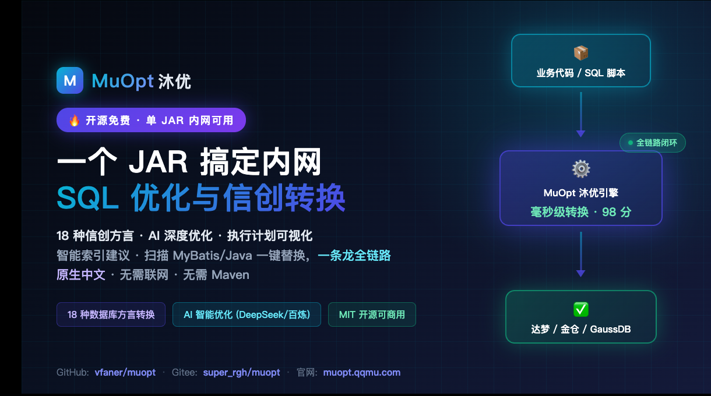</a>

## 💡 Background

As China's IT-application localization (信创/xinchuang) initiative rolls out across government and enterprise, a huge amount of legacy business code has to migrate from MySQL / Oracle to domestic databases such as Dameng, KingBase and GaussDB. At the same time, everyday slow-SQL troubleshooting lacks an IDE-independent, out-of-the-box tool:

- **SQL optimization has a high barrier**: DBA resources are scarce; frontline developers struggle to judge "does this query need an index, and on which columns". Raw EXPLAIN output is hard to read without intuitive visualization;
- **Dialect migration is enormous work**: a single project easily carries thousands of SQL statements scattered across MyBatis XML, Java annotations and `.sql` scripts; rewriting them by hand is tedious and error-prone;
- **Intranet environments lack tools**: many corporate networks cannot reach online services, and cloud tools fail security audits — a self-contained local tool that can be copied behind the firewall is needed.

MuOpt exists to solve exactly these three problems: **a Swiss-army knife for SQL optimization and xinchuang conversion that you can carry into an intranet**.

## 📖 Introduction

MuOpt is a Spring Boot 3 web application for SQL optimization and cross-dialect conversion. It deploys as a single fat jar and works in the browser — no client installation.

**Core capabilities:**

- 🎯 **Smart index suggestions**: Parses the AST with JSqlParser and extracts candidate columns from WHERE equality/range conditions, JOIN ON, ORDER BY and GROUP BY; suggestions are color-coded **orange (to create) / gray (already exists)**, auto-verified once a data source is connected
- ✏️ **Manual optimization**: Paste a single query for instant analysis; AI deep rewriting falls back to local rule-based rewrites on timeout/failure
- 🔍 **Scan optimization**: Extract SQL from MyBatis XML, Java strings and annotations (`@Select`/`@Insert`/`@Update`/`@Delete`); analyze each and replace in place with one click (auto `.bak` backup)
- 🔄 **Xinchuang conversion**: Manual and batch modes; a rule engine converts across 18 database dialects in milliseconds (functions, types, pagination, auto-increment, date format strings), optionally followed by an AI dialect-polish pass; whole-project conversion writes results back to source files
- 🤖 **AI deep optimization** (optional): Configure multiple models (Bailian / DeepSeek / OpenAI / Anthropic and any OpenAI-compatible gateway), one active at a time; reasoning models' thinking chains can be disabled to prevent long-SQL truncation
- 🔗 **Data source configuration** (optional): A dozen-plus bundled drivers; once connected, index existence checks, redundant-index detection (DROP suggestions) and small/large-table-driving analysis become available
- 📊 **SQL execution plan**: Runs EXPLAIN against the connected data source with **Table / Tree / Diagram** views (DBeaver-style), color-coded by operation type (full scan red, index green, join purple) plus cost evaluation
- 🔐 **Accounts**: Login authentication (5 consecutive failures lock the account for 30 minutes) and self-service password change in the profile page

### 🖼️ Screenshots

> The UI is in Chinese; captions below describe each screen.

**Login** (5 consecutive failures lock the account for 30 minutes):

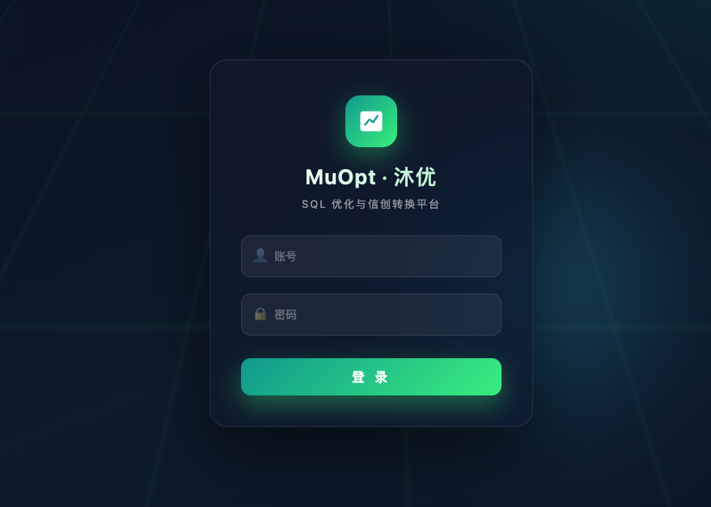

**Optimize · Manual** (orange/gray index suggestions, AI deep rewriting):

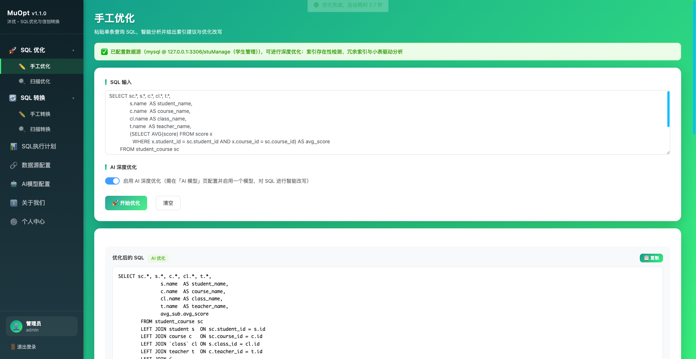

**Optimize · Scan** (background job, 8 concurrent AI rewrites, one-click write-back):

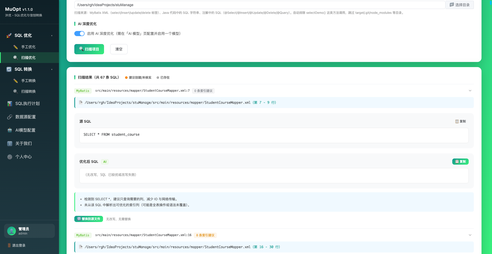

**Convert · Manual** (single-statement dialect conversion with image OCR and AI polish):

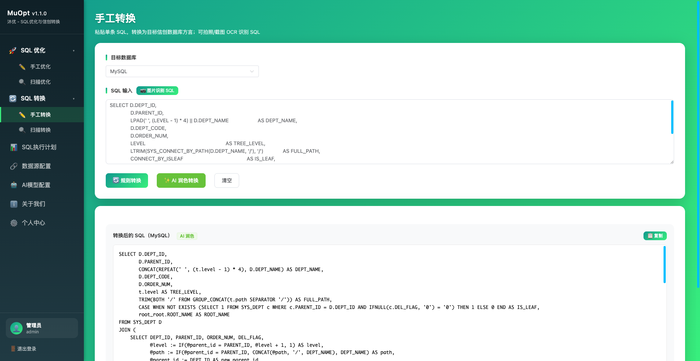

**Convert · Scan** (whole-project batch conversion with automatic `.bak` backups):

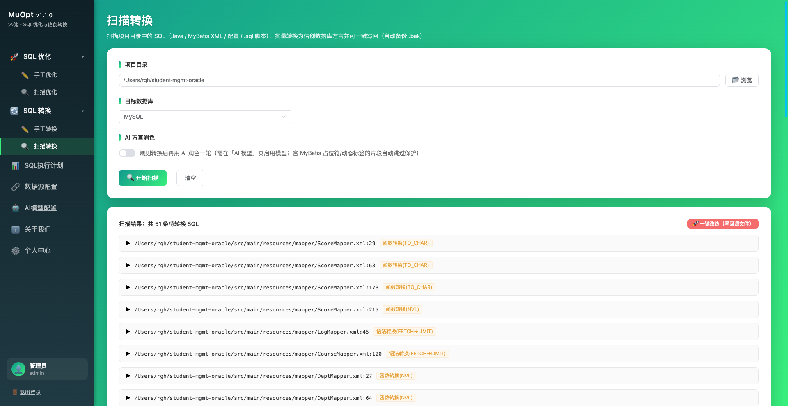

**Data sources** (multiple connections, exclusive enable, passwords encrypted at rest):

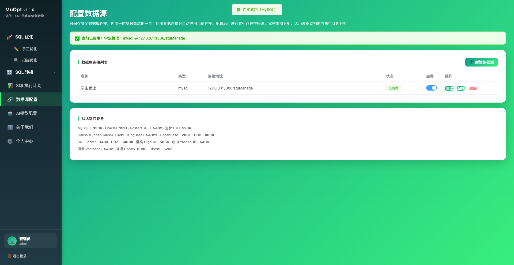

**AI models** (multiple configs, exclusive enable, connectivity probes):

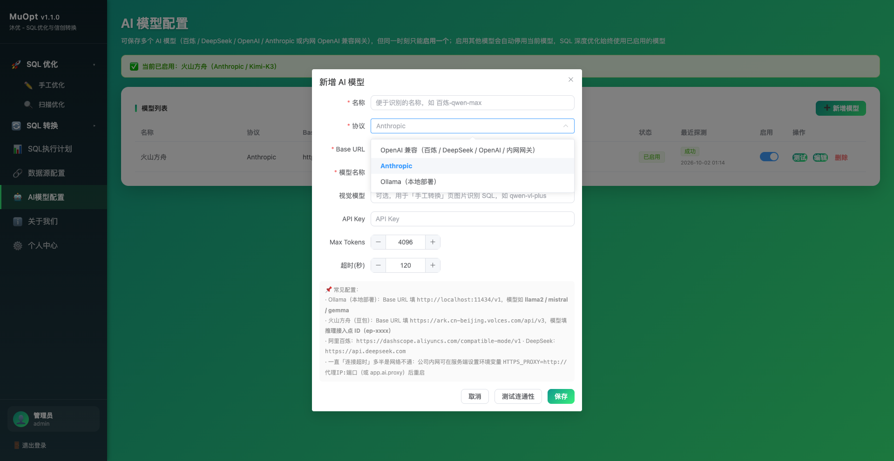

**Execution plan** (table / tree / diagram views):

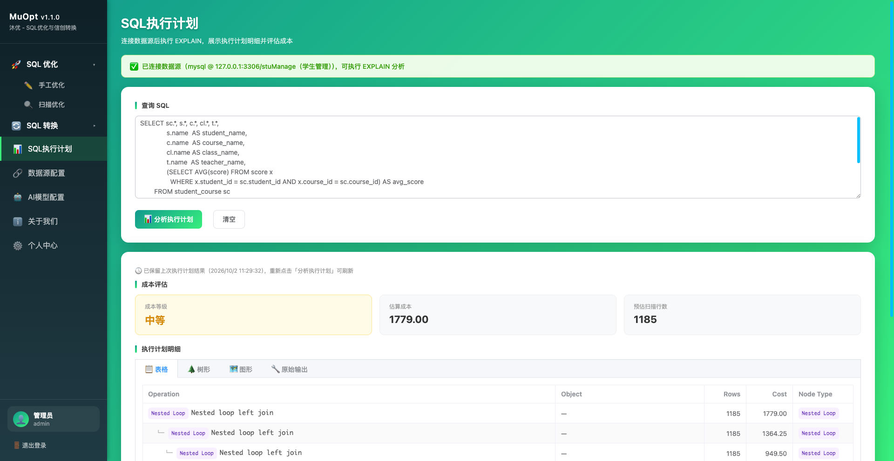

**About** (version comparison against GitHub / Gitee releases, online self-update):

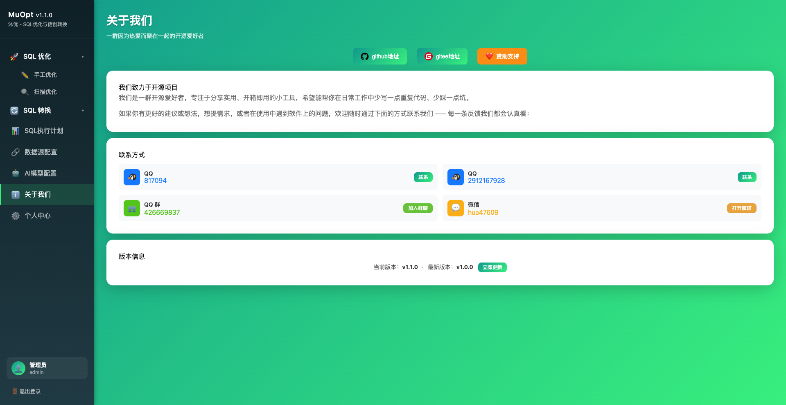

**Profile** (self-service password change):

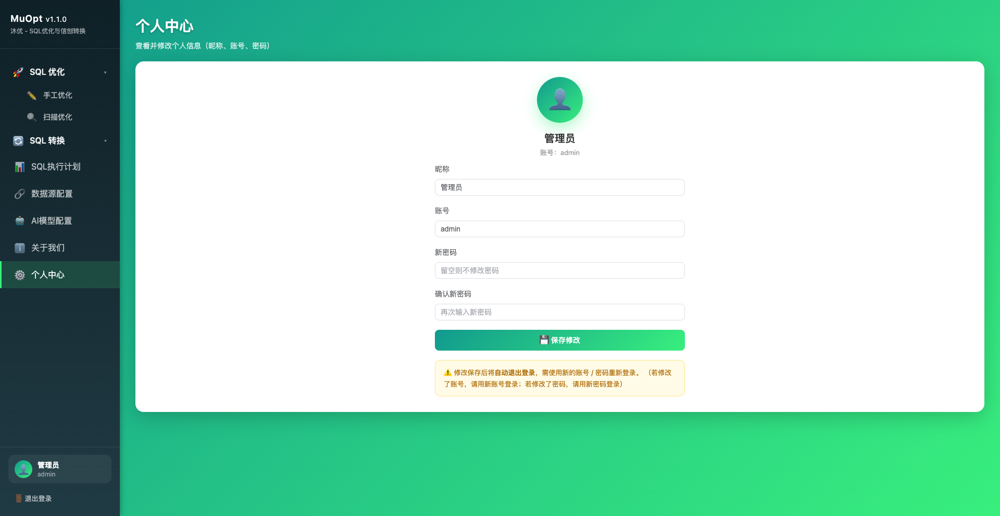

## 🛠️ Tech Stack

| Component | Technology |
|-----------|------------|
| Backend | Spring Boot 3.2, JSqlParser 4.9, HikariCP, JDK HttpClient |
| Frontend | Vue 3 CDN + Element Plus CDN (pure HTML, no build tool) |
| Data store | Embedded H2 file database (`./data`) + Spring Data JPA; passwords/API keys encrypted at rest with spring-security-crypto |
| AI API | OpenAI-compatible protocol (Bailian / DeepSeek / OpenAI / intranet gateways) + Anthropic Messages protocol |
| DB drivers | MySQL, PostgreSQL, Oracle, SQL Server, DB2, Dameng DM8, openGauss, KingBaseES, OceanBase, HighGo, YashanDB (all bundled) |
| Build & run | Maven, JDK 17+ |

## 🚀 Deployment

```bash
cd muopt

# 1. Build & package (requires Maven + JDK 17+)
mvn clean package

# 2. Run (default port 8080)
java -jar target/muopt.jar
```

Visit: http://localhost:8080 and register/login on first use.

The build produces a single executable muopt.jar (~70MB; drivers for a dozen-plus databases and the frontend are bundled). Copy it to any intranet machine with **JDK 17+** and run it directly — no Maven or internet access required:

```bash
java -jar muopt.jar
# Optional overrides: port / bind address / config-store encryption secret
java -jar muopt.jar --server.port=8080 --server.address=0.0.0.0
```

Deployment notes:

- Database and AI configurations are stored in `./data` (embedded H2 file database) next to the working directory; logs go to `./logs/`. Persist/back up these directories, and **never delete `./data`** or all configurations are lost. Always launch from the same working directory, or pin the store to an absolute path via `APP_DATA_DIR` (e.g. `APP_DATA_DIR=/var/muopt/data`).
- By default the app binds `127.0.0.1` only; set `--server.address=0.0.0.0` (plus gateway-level auth) for LAN access.
- Drivers for all common databases are bundled (see table below); for databases without a public Maven artifact (e.g. GBase 8a) fill in the vendor jar path on the data source form, and any other JDBC database works via the "custom" type.
- AI calls go directly from the server to the configured Base URL — make sure that endpoint is reachable from the intranet host.

### Configure AI (optional)

On the "AI Models" page, add a configuration: pick the protocol (OpenAI-compatible / Anthropic), fill in the Base URL, model name and API key, optionally run "Test connectivity", then save and switch it on. Multiple models can be saved but only one is enabled at a time — enabling one automatically disables the others. The Base URL is free-form, so any OpenAI-compatible intranet gateway or self-hosted inference service works. Index analysis and rule-based rewriting work fine without an enabled model.

## 📊 Supported Databases

**Conversion target dialects (18)**: MySQL, MariaDB, PostgreSQL, GaussDB, openGauss, KingBaseES, HighGo, Vastbase, Dameng, Oracle, YashanDB, SQL Server, DB2, OceanBase, TiDB, GBase, GoldenDB, ShenTong Oscar.

**Data source connection:**

| Database | Type ID | Driver | Default Port |
|----------|---------|--------|--------------|
| MySQL | `mysql` | **mysql-connector-j (bundled)** | 3306 |
| MariaDB | `mariadb` | **mariadb-java-client (bundled)** | 3306 |
| Oracle | `oracle` | **ojdbc8 (bundled)** | 1521 |
| PostgreSQL | `postgresql` | **postgresql (bundled)** | 5432 |
| SQL Server | `sqlserver` | **mssql-jdbc (bundled)** | 1433 |
| DB2 | `db2` | **jcc (bundled)** | 50000 |
| Dameng DM8 | `dameng` | **DmJdbcDriver18 (bundled)** | 5236 |
| GaussDB | `gaussdb` | PostgreSQL driver (PG wire protocol) | 5432 |
| openGauss | `opengauss` | **opengauss-jdbc (bundled)** | 5432 |
| KingBaseES V8 | `kingbase` | **kingbase8 (bundled)** | 54321 |
| OceanBase | `oceanbase` | **oceanbase-client (bundled)** | 2881 |
| TiDB | `tidb` | MySQL driver (MySQL wire protocol) | 4000 |
| HighGo | `highgo` | **HgdbJdbc (bundled)** | 5866 |
| YashanDB | `yashandb` | **yashandb-jdbc (bundled)** | 5436 |
| Vastbase | `vastbase` | PostgreSQL-compatible driver by default; vendor driver when a jar path is given | 5432 |
| ShenTong Oscar | `oscar` | PostgreSQL-compatible driver by default; vendor driver when a jar path is given | 8080 |
| GBase 8a | `gbase` | Vendor jar required (server-local path) | 5258 |
| H2 | `h2` | **h2 (bundled)** | — |
| Custom | `custom` | Full JDBC URL + driver class name; supply a server-local jar path (file or directory, `;`-separated) and use "scan jar" to discover the driver class | — |

All bundled drivers come from Maven Central and ship inside the fat jar. Databases without a Central artifact follow a compatibility strategy: TiDB / GaussDB use the matching wire-protocol driver; Vastbase / Oscar default to the PostgreSQL-compatible driver and switch to the vendor driver when a jar path is given; GBase 8a needs the vendor jar; everything else goes through the "custom" type. If your database version is incompatible with a bundled driver, fill in the newer vendor jar path on that data source — no repackaging required.

## 📝 Notes

1. **Accounts & security**: 5 consecutive login failures lock the account for 30 minutes; sessions are HttpSession-based; passwords can be changed in the profile page. The app binds `127.0.0.1` by default — add gateway-level auth before exposing it to a LAN.
2. **Config persistence & encryption**: Any number of database connections and AI models can be saved, at most one of each enabled at a time (enforced in a server-side transaction); configs persist in `./data` across restarts. Passwords/API keys are encrypted at rest, never returned to the frontend, and leaving the field blank on edit keeps the stored value. Override the encryption secret via `APP_CRYPTO_PASSWORD` / `APP_CRYPTO_SALT`.
3. **Background jobs survive page switches**: Optimization and scans immediately return a job id and execute on a server thread; switching menus or refreshing the page resumes the running state automatically. Results are retained for 30 minutes (lost on server restart) and jobs can be cancelled at any time.
4. **AI in scan mode**: every SQL gets millisecond-level local rule analysis first; AI rewrites then run concurrently (default 8 in parallel, 120s overall deadline, 45s per-request cap). Items not finished by the deadline fall back to local deterministic rewrites with a timeout note. Tune via `APP_AI_SCAN_CONCURRENCY` / `APP_AI_SCAN_TIMEOUT` / `APP_AI_SCAN_PER_REQUEST_TIMEOUT`.
5. **Automatic fallback when AI fails**: whether the model is missing, a request times out, the connection fails or the response is empty, the tool falls back to deterministic, semantics-preserving rewrites (implicit comma joins → ANSI `INNER JOIN ... ON`, non-aggregated HAVING predicates move to WHERE, `SELECT *` expands to concrete columns from metadata), tagged "rule rewrite" with every change listed; otherwise the original is kept with an explanation.
6. **Reasoning models & thinking chains**: AI rewriting/polishing disables reasoning models' thinking chains by default (`enable_thinking:false` etc.) so the whole Max Tokens budget goes to the SQL output — preventing long-SQL truncation and slow timeouts; the switch can be turned off per model in the AI configuration dialog for deep-thinking scenarios.
7. **AI networking and proxies**: connect timeouts (unreachable host, typical on corporate networks) and response timeouts (busy model, wrong Base URL / model name; Volcengine Ark requires an endpoint ID `ep-xxxx`) produce distinct messages. Set `HTTPS_PROXY` (or `APP_AI_PROXY`) and restart if outbound traffic requires a proxy; localhost endpoints always connect directly.
8. **Execution-plan safety**: PostgreSQL-family databases use `EXPLAIN` (without ANALYZE), so no write operations are actually executed.
9. **Writing back to source files**: the one-click replace in scan optimization/conversion always creates `.bak` backups; still, prefer running under version control and reviewing diffs before replacing.
10. **Adjustable thresholds**: an execution-plan cost ≥10000 is considered high before suggesting an index; an estimated scan of ≤500 rows hints no index is needed (thresholds adjustable in `ExplainService`).

## 📞 Contact

Questions, feature requests and feedback are all welcome:

| Channel | Account |
|---------|---------|
| QQ | 817094 |
| QQ | 2912167928 |
| QQ Group | 426669837 |
| WeChat | qqmu66 |

Issues are welcome on GitHub / Gitee:

- GitHub: https://github.com/vfaner/muopt
- Gitee: https://gitee.com/super_rgh/muopt

## ☕ Donation Support

If this project helps you, feel free to buy me a coffee ❤️ (the in-app "Donation Support" menu switches between WeChat / Alipay / QQ QR codes).

## ⭐ Star Support

If you find it useful, please give the project a **[Star](https://github.com/vfaner/muopt)** — it's the greatest encouragement for the author!

## 📄 License

This project is licensed under the [MIT License](LICENSE).
